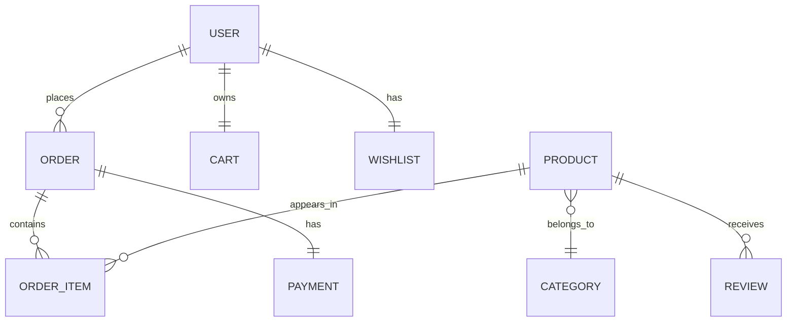

# SNEAKERS — E‑commerce Full Stack (Cameroun)

Projet e‑commerce complet de sneakers avec front‑end et back‑end. Panier, paiement réel (Carte, Mobile Money, PayPal), confirmation de commande, favoris, filtres/tri, modal produit, galerie, pages légales, et gestion utilisateurs avec base de données.

## Fonctionnalités Front‑End
- Panier avec compteur, mini‑bar de total et toasts
- Paiements réels: `Carte`, `Mobile Money`, `PayPal`
- Partage commande: WhatsApp et e‑mail
- Confirmation de commande avec reçu imprimable
- Filtres: recherche, catégorie, tri prix, tags `Nouveau`/`Promo`
- Favoris (wishlist) persistants en base de données
- Modal de détail produit et ajout au panier
- Compte: inscription/connexion réelle, profils persistants
- Galerie d'images et mur d'icônes de services
- Pages légales (mentions, confidentialité, conditions de vente, remboursement)
- Accessibilité: `aria-live`, `role=status`, tabs accessibles

## Fonctionnalités Back‑End
- API RESTful complète avec Node.js/Express
- Base de données MySQL optimisée avec schéma complet
- Authentification JWT sécurisée
- Gestion des utilisateurs et profils
- Système de panier persistant
- Traitement des commandes avec suivi statut
- Intégration paiements réels (Stripe, Mobile Money, PayPal)
- Système d'avis et notes produits
- API de recherche et filtrage avancée

## Aperçu local
- Lancer le serveur: `python -m http.server 5500`
- Ouvrir: `http://localhost:5500/`

## Structure
### Front‑End
- `index.html`: sections, cartes produits, modals, légales, galerie
- `style.css`: styles globaux, filtres, modals, badges, icônes
- `app.js`: panier, paiement démo, filtres, favoris, modal, compte, confirmation

### Back‑End
- `backend-examples.js`: API Node.js/Express complète
- `database-schema.sql`: Schéma MySQL Workbench complet
- `backend-diagram.md`: Documentation architecture backend

## Installation et Configuration

### Prérequis
- Node.js 16+
- MySQL 8.0+ ou MariaDB 10.5+
- npm ou yarn

### Base de Données
```bash
# Importer le schéma MySQL Workbench
mysql -u root -p < database-schema.sql

# Ou importer via MySQL Workbench
# File > Run SQL Script > database-schema.sql
```

### Backend
```bash
# Installer les dépendances
npm install express bcryptjs jsonwebtoken pg mysql2

# Configurer les variables d'environnement
cp .env.example .env
# Éditer .env avec vos clés API et DB config

# Démarrer le serveur
npm start
# ou nodemon backend-examples.js
```

### Front‑End
```bash
# Lancer le serveur de développement
python -m http.server 5500
# Ouvrir: http://localhost:5500/
```

## Architecture Base de Données

### Schéma MySQL Workbench
Le schéma complet est disponible dans `database-schema.sql` avec :

**Tables principales:**
- `users` - Profils utilisateurs
- `products` - Catalogue sneakers  
- `categories` - Catégories (Lifestyle, Running, etc.)
- `orders` - Commandes clients
- `order_items` - Détails commandes
- `payments` - Paiements multi-méthodes
- `cart` / `cart_items` - Paniers persistants
- `wishlists` / `wishlist_items` - Favoris
- `reviews` - Avis produits
- `addresses` - Adresses multiples

**Fonctionnalités avancées:**
- Index optimisés pour performance
- Contraintes d'intégrité référentielle
- Triggers automatiques pour gestion stock
- Vues pour statistiques et reporting
- Procédures stockées pour analyses

### Diagramme ERD


## API Endpoints

### Authentification
- `POST /api/auth/register` - Inscription
- `POST /api/auth/login` - Connexion
- `GET /api/users/profile` - Profil utilisateur

### Produits
- `GET /api/products` - Liste avec filtres
- `GET /api/products/:id` - Détail produit
- `POST /api/products` - Créer produit (admin)

### Panier
- `GET /api/cart` - Panier utilisateur
- `POST /api/cart/items` - Ajouter article
- `PUT /api/cart/items/:id` - Modifier quantité
- `DELETE /api/cart/items/:id` - Supprimer article

### Commandes
- `GET /api/orders` - Historique commandes
- `POST /api/orders` - Créer commande
- `GET /api/orders/:id` - Détail commande

### Paiements
- `POST /api/payments/process` - Traiter paiement
- `GET /api/payments/:id` - Statut paiement

## Déploiement
- Front‑end statique — peut être publié sur GitHub Pages ou tout hébergeur statique

## Repository
- GitHub: https://github.com/kamga144joel/SNEAKERS

## Associer le projet au dépôt
Dans le répertoire du projet:

```powershell
# Initialiser (si nécessaire)
git init

# Ajouter ou mettre à jour le remote origin
git remote add origin https://github.com/kamga144joel/SNEAKERS 2>$null || git remote set-url origin https://github.com/kamga144joel/SNEAKERS

# Vérifier
git remote -v
```

## Pousser (optionnel)
```powershell
git add .
git commit -m "Initial import"
git branch -M main
git push -u origin main
https://github.com/kamga144joel/SNEAKERS/blob/main/README.md
https://joel-kamga-sneakear.netlify.app/#arrivages
```
