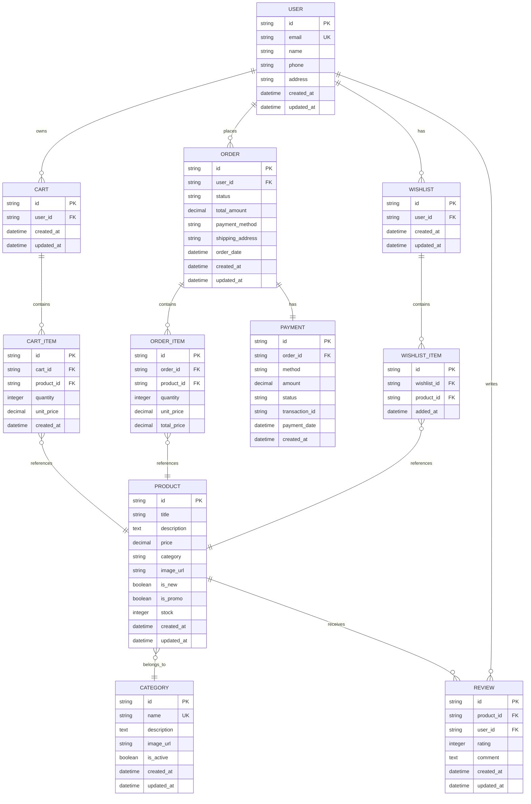

# Diagramme de Classes Backend - SNEAKERS

## Architecture des Données

## Description des Entités

### User (Utilisateur)
- **id**: Identifiant unique
- **email**: Email unique pour connexion
- **name**: Nom complet
- **phone**: Téléphone (format camerounais)
- **address**: Adresse de livraison
- **created_at/updated_at**: Timestamps

### Product (Produit)
- **id**: Identifiant unique
- **title**: Nom du produit
- **description**: Description détaillée
- **price**: Prix en FCFA
- **category**: Catégorie (Lifestyle, Running, etc.)
- **image_url**: URL de l'image
- **is_new**: Badge "Nouveau"
- **is_promo**: Badge "Promo"
- **stock**: Quantité disponible

### Category (Catégorie)
- **id**: Identifiant unique
- **name**: Nom unique
- **description**: Description
- **image_url**: Image de la catégorie
- **is_active**: Catégorie active/inactive

### Cart & CartItem (Panier)
- **Cart**: Panier par utilisateur
- **CartItem**: Articles dans le panier avec quantité

### Order & OrderItem (Commande)
- **Order**: Commande avec statut et paiement
- **OrderItem**: Détails des produits commandés

### Payment (Paiement)
- **method**: carte, mobile, paypal, cod
- **status**: pending, completed, failed
- **transaction_id**: ID de transaction

### Wishlist & WishlistItem (Favoris)
- **Wishlist**: Liste de favoris par utilisateur
- **WishlistItem**: Produits en favoris

### Review (Avis)
- **rating**: Note 1-5 étoiles
- **comment**: Commentaire utilisateur
- **created_at**: Date de l'avis

## API Endpoints Suggérés

### Users
- `POST /api/auth/register` - Inscription
- `POST /api/auth/login` - Connexion
- `GET /api/users/profile` - Profil
- `PUT /api/users/profile` - Mise à jour

### Products
- `GET /api/products` - Liste avec filtres
- `GET /api/products/:id` - Détail produit
- `GET /api/categories` - Categories
- `POST /api/products` - Créer produit (admin)

### Cart
- `GET /api/cart` - Panier utilisateur
- `POST /api/cart/items` - Ajouter article
- `PUT /api/cart/items/:id` - Modifier quantité
- `DELETE /api/cart/items/:id` - Supprimer article

### Orders
- `GET /api/orders` - Historique commandes
- `POST /api/orders` - Créer commande
- `GET /api/orders/:id` - Détail commande

### Payments
- `POST /api/payments/process` - Traiter paiement
- `GET /api/payments/:id` - Statut paiement

### Wishlist
- `GET /api/wishlist` - Favoris
- `POST /api/wishlist/items` - Ajouter favori
- `DELETE /api/wishlist/items/:id` - Supprimer favori

## Technologies Recommandées

### Backend
- **Node.js + Express** ou **Python + Django/FastAPI**
- **PostgreSQL** pour la base de données
- **Redis** pour le cache et sessions
- **JWT** pour l'authentification

### Paiements
- **Stripe** pour cartes bancaires
- **Orange Money/MTN APIs** pour Mobile Money
- **PayPal SDK** pour PayPal

### Infrastructure
- **Docker** pour containerisation
- **AWS/Azure/GCP** pour hébergement
- **Cloudinary** pour images
- **SendGrid** pour emails

## Sécurité

- **Hashage mot de passe** (bcrypt)
- **Validation inputs** (express-validator)
- **Rate limiting** (express-rate-limit)
- **CORS** configuré
- **HTTPS** obligatoire
- **JWT tokens** avec expiration
