# SNEAKERS - Documentation Complète des Schémas

> **Projet E-commerce Full Stack** - Cameroun  
> **Date:** 15 Décembre 2025  
> **Version:** 1.0

---

## Équipe du Projet

**Membre du groupe:**
- **Nom:** Kamga Tagne Thierry Joel
- **Classe:** E-302
- **Matricule:** 24I 011 80

---

## Table des Matières

1. [Architecture Générale](#architecture-générale)
2. [Base de Données MySQL](#base-de-données-mysql)
3. [API Backend](#api-backend)
4. [Frontend Architecture](#frontend-architecture)
5. [Flux de Données](#flux-de-données)
6. [Sécurité](#sécurité)

---

## Architecture Générale

### Vue d'ensemble du Système

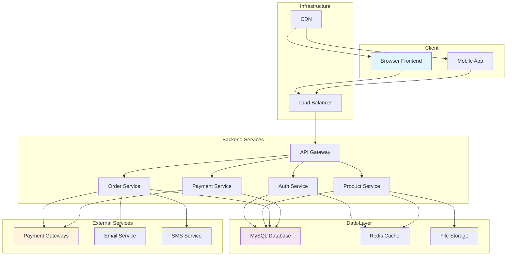
```mermaid
flowchart TD
    subgraph "Client"
        A[Browser Frontend]
        B[Mobile App]
    end
    
    subgraph "Infrastructure"
        C[Load Balancer]
        D[CDN]
    end
    
    subgraph "Backend Services"
        E[API Gateway]
        F[Auth Service]
        G[Product Service]
        H[Order Service]
        I[Payment Service]
    end
    
    subgraph "Data Layer"
        J[MySQL Database]
        K[Redis Cache]
        L[File Storage]
    end
    
    subgraph "External Services"
        M[Payment Gateways]
        N[Email Service]
        O[SMS Service]
    end
    
    A --> C
    B --> C
    C --> E
    D --> A
    D --> B
    
    E --> F
    E --> G
    E --> H
    E --> I
    
    F --> J
    G --> J
    H --> J
    I --> J
    
    F --> K
    G --> K
    
    G --> L
    H --> M
    I --> M
    H --> N
    H --> O

    style A fill:#e1f5fe
    style J fill:#f3e5f5
    style M fill:#fff3e0
```

### Stack Technique

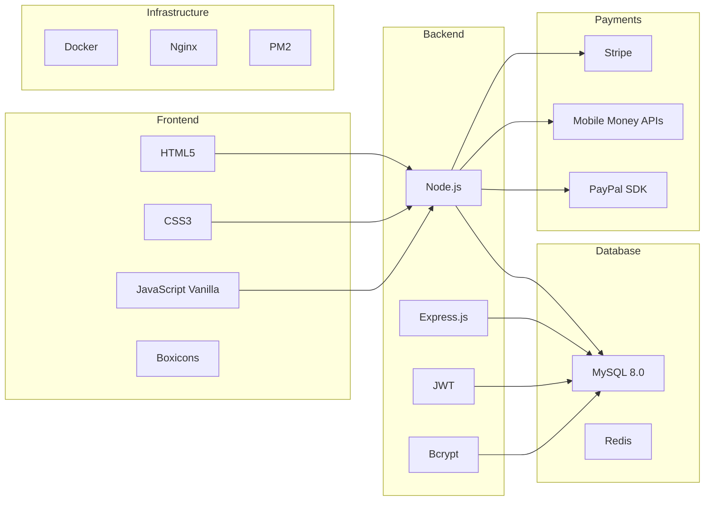
```mermaid
graph LR
    subgraph "Frontend"
        A[HTML5]
        B[CSS3]
        C[JavaScript Vanilla]
        D[Boxicons]
    end
    
    subgraph "Backend"
        E[Node.js]
        F[Express.js]
        G[JWT]
        H[Bcrypt]
    end
    
    subgraph "Database"
        I[MySQL 8.0]
        J[Redis]
    end
    
    subgraph "Infrastructure"
        K[Docker]
        L[Nginx]
        M[PM2]
    end
    
    subgraph "Payments"
        N[Stripe]
        O[Mobile Money APIs]
        P[PayPal SDK]
    end
    
    A --> E
    B --> E
    C --> E
    E --> I
    F --> I
    G --> I
    H --> I
    
    E --> N
    E --> O
    E --> P
```

---

## Base de Données MySQL

### Schéma Complet ERD

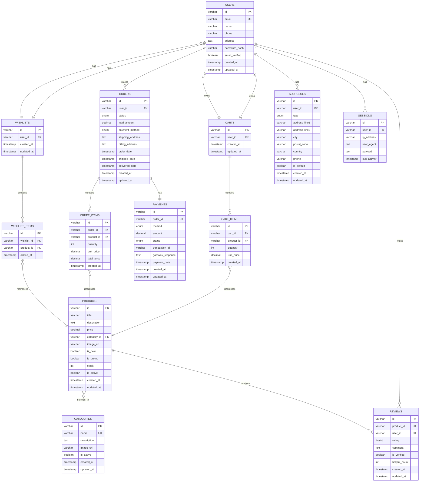
```mermaid
erDiagram
    USERS {
        varchar id PK
        varchar email UK
        varchar name
        varchar phone
        text address
        varchar password_hash
        boolean email_verified
        timestamp created_at
        timestamp updated_at
    }
    
    CATEGORIES {
        varchar id PK
        varchar name UK
        text description
        varchar image_url
        boolean is_active
        timestamp created_at
        timestamp updated_at
    }
    
    PRODUCTS {
        varchar id PK
        varchar title
        text description
        decimal price
        varchar category_id FK
        varchar image_url
        boolean is_new
        boolean is_promo
        int stock
        boolean is_active
        timestamp created_at
        timestamp updated_at
    }
    
    CARTS {
        varchar id PK
        varchar user_id FK
        timestamp created_at
        timestamp updated_at
    }
    
    CART_ITEMS {
        varchar id PK
        varchar cart_id FK
        varchar product_id FK
        int quantity
        decimal unit_price
        timestamp created_at
    }
    
    ORDERS {
        varchar id PK
        varchar user_id FK
        enum status
        decimal total_amount
        enum payment_method
        text shipping_address
        text billing_address
        timestamp order_date
        timestamp shipped_date
        timestamp delivered_date
        timestamp created_at
        timestamp updated_at
    }
    
    ORDER_ITEMS {
        varchar id PK
        varchar order_id FK
        varchar product_id FK
        int quantity
        decimal unit_price
        decimal total_price
        timestamp created_at
    }
    
    PAYMENTS {
        varchar id PK
        varchar order_id FK
        enum method
        decimal amount
        enum status
        varchar transaction_id
        text gateway_response
        timestamp payment_date
        timestamp created_at
        timestamp updated_at
    }
    
    WISHLISTS {
        varchar id PK
        varchar user_id FK
        timestamp created_at
        timestamp updated_at
    }
    
    WISHLIST_ITEMS {
        varchar id PK
        varchar wishlist_id FK
        varchar product_id FK
        timestamp added_at
    }
    
    REVIEWS {
        varchar id PK
        varchar product_id FK
        varchar user_id FK
        tinyint rating
        text comment
        boolean is_verified
        int helpful_count
        timestamp created_at
        timestamp updated_at
    }
    
    ADDRESSES {
        varchar id PK
        varchar user_id FK
        enum type
        varchar address_line1
        varchar address_line2
        varchar city
        varchar postal_code
        varchar country
        varchar phone
        boolean is_default
        timestamp created_at
        timestamp updated_at
    }
    
    SESSIONS {
        varchar id PK
        varchar user_id FK
        varchar ip_address
        text user_agent
        text payload
        timestamp last_activity
    }

    USERS ||--|| CARTS : owns
    USERS ||--o{ ORDERS : places
    USERS ||--|| WISHLISTS : has
    USERS ||--o{ REVIEWS : writes
    USERS ||--o{ ADDRESSES : has
    USERS ||--o{ SESSIONS : has
    
    CARTS ||--o{ CART_ITEMS : contains
    CART_ITEMS }o--|| PRODUCTS : references
    
    ORDERS ||--o{ ORDER_ITEMS : contains
    ORDERS ||--|| PAYMENTS : has
    ORDER_ITEMS }o--|| PRODUCTS : references
    
    WISHLISTS ||--o{ WISHLIST_ITEMS : contains
    WISHLIST_ITEMS }o--|| PRODUCTS : references
    
    PRODUCTS }o--|| CATEGORIES : belongs_to
    PRODUCTS ||--o{ REVIEWS : receives
    
    USERS }o--|| CARTS : owns
    USERS }o--|| WISHLISTS : has
```

### Structure des Tables Détaillée

#### Table USERS
```sql
CREATE TABLE users (
    id VARCHAR(36) PRIMARY KEY DEFAULT (UUID()),
    email VARCHAR(255) NOT NULL UNIQUE,
    name VARCHAR(255) NOT NULL,
    phone VARCHAR(20),
    address TEXT,
    password_hash VARCHAR(255) NOT NULL,
    email_verified BOOLEAN DEFAULT FALSE,
    created_at TIMESTAMP DEFAULT CURRENT_TIMESTAMP,
    updated_at TIMESTAMP DEFAULT CURRENT_TIMESTAMP ON UPDATE CURRENT_TIMESTAMP
);
```

#### Table PRODUCTS
```sql
CREATE TABLE products (
    id VARCHAR(36) PRIMARY KEY DEFAULT (UUID()),
    title VARCHAR(255) NOT NULL,
    description TEXT,
    price DECIMAL(10,2) NOT NULL,
    category_id VARCHAR(36),
    image_url VARCHAR(500),
    is_new BOOLEAN DEFAULT FALSE,
    is_promo BOOLEAN DEFAULT FALSE,
    stock INT DEFAULT 0,
    is_active BOOLEAN DEFAULT TRUE,
    created_at TIMESTAMP DEFAULT CURRENT_TIMESTAMP,
    updated_at TIMESTAMP DEFAULT CURRENT_TIMESTAMP ON UPDATE CURRENT_TIMESTAMP
);
```

---

## API Backend

### Architecture des Services

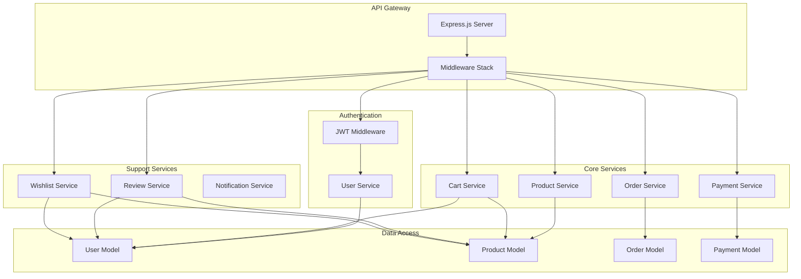
```mermaid
flowchart TD
    subgraph "API Gateway"
        A[Express.js Server]
        B[Middleware Stack]
    end
    
    subgraph "Authentication"
        C[JWT Middleware]
        D[User Service]
    end
    
    subgraph "Core Services"
        E[Product Service]
        F[Cart Service]
        G[Order Service]
        H[Payment Service]
    end
    
    subgraph "Support Services"
        I[Review Service]
        J[Wishlist Service]
        K[Notification Service]
    end
    
    subgraph "Data Access"
        L[User Model]
        M[Product Model]
        N[Order Model]
        O[Payment Model]
    end
    
    A --> B
    B --> C
    B --> E
    B --> F
    B --> G
    B --> H
    B --> I
    B --> J
    
    C --> D
    D --> L
    
    E --> M
    F --> L
    F --> M
    G --> N
    H --> O
    I --> L
    I --> M
    J --> L
    J --> M
```

### Endpoints API

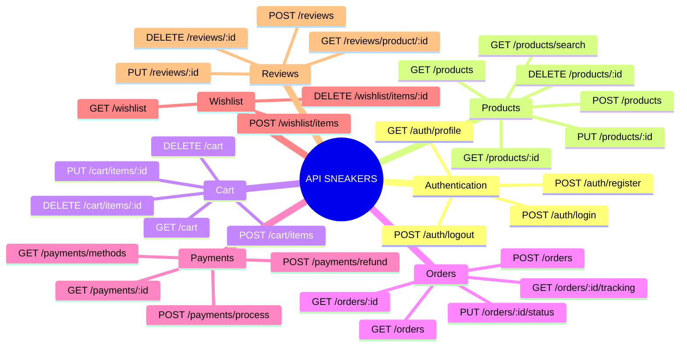
```mermaid
mindmap
  root((API SNEAKERS))
    Authentication
      POST /auth/register
      POST /auth/login
      GET /auth/profile
      POST /auth/logout
    Products
      GET /products
      GET /products/:id
      POST /products
      PUT /products/:id
      DELETE /products/:id
      GET /products/search
    Cart
      GET /cart
      POST /cart/items
      PUT /cart/items/:id
      DELETE /cart/items/:id
      DELETE /cart
    Orders
      GET /orders
      POST /orders
      GET /orders/:id
      PUT /orders/:id/status
      GET /orders/:id/tracking
    Payments
      POST /payments/process
      GET /payments/:id
      POST /payments/refund
      GET /payments/methods
    Wishlist
      GET /wishlist
      POST /wishlist/items
      DELETE /wishlist/items/:id
    Reviews
      GET /reviews/product/:id
      POST /reviews
      PUT /reviews/:id
      DELETE /reviews/:id
```

---

## Frontend Architecture

### Structure des Composants

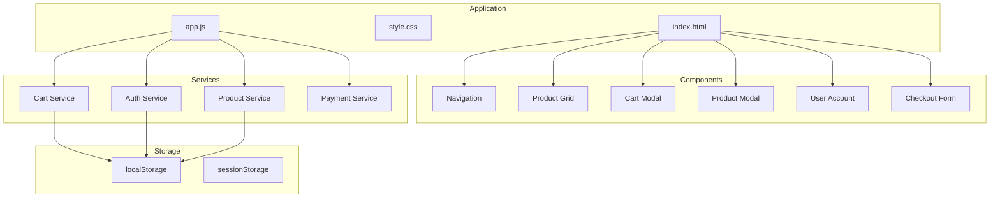
```mermaid
graph TD
    subgraph "Application"
        A[index.html]
        B[style.css]
        C[app.js]
    end
    
    subgraph "Components"
        D[Navigation]
        E[Product Grid]
        F[Cart Modal]
        G[Product Modal]
        H[User Account]
        I[Checkout Form]
    end
    
    subgraph "Services"
        J[Cart Service]
        K[Auth Service]
        L[Product Service]
        M[Payment Service]
    end
    
    subgraph "Storage"
        N[localStorage]
        O[sessionStorage]
    end
    
    A --> D
    A --> E
    A --> F
    A --> G
    A --> H
    A --> I
    
    C --> J
    C --> K
    C --> L
    C --> M
    
    J --> N
    K --> N
    L --> N
```

### Flux Utilisateur

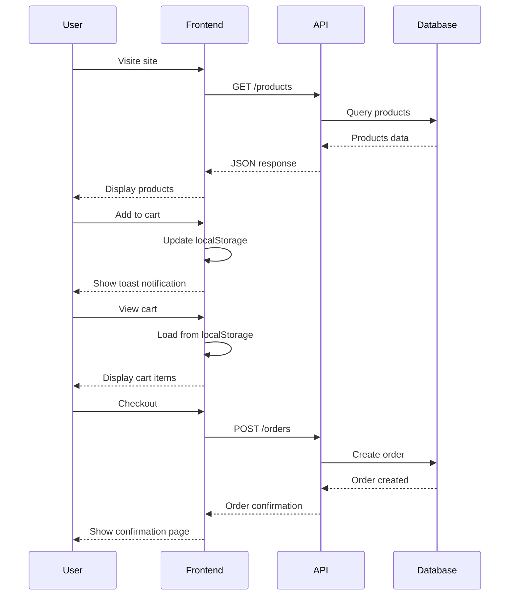
```mermaid
sequenceDiagram
    participant U as User
    participant F as Frontend
    participant A as API
    participant D as Database
    
    U->>F: Visite site
    F->>A: GET /products
    A->>D: Query products
    D-->>A: Products data
    A-->>F: JSON response
    F-->>U: Display products
    
    U->>F: Add to cart
    F->>F: Update localStorage
    F-->>U: Show toast notification
    
    U->>F: View cart
    F->>F: Load from localStorage
    F-->>U: Display cart items
    
    U->>F: Checkout
    F->>A: POST /orders
    A->>D: Create order
    D-->>A: Order created
    A-->>F: Order confirmation
    F-->>U: Show confirmation page
```

---

## Diagrammes UML Complets

### Diagramme de Classes UML

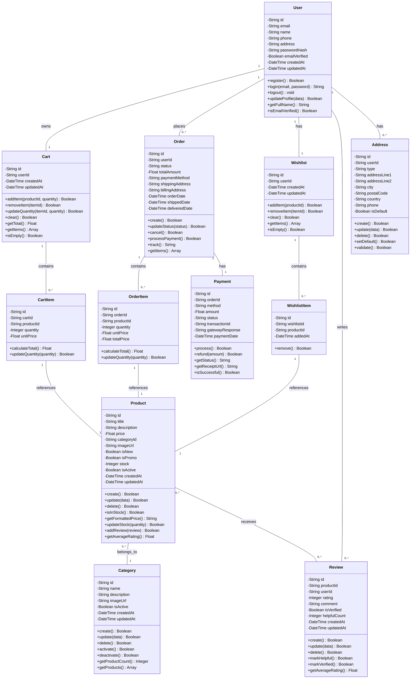
```mermaid
classDiagram
    class User {
        -String id
        -String email
        -String name
        -String phone
        -String address
        -String passwordHash
        -Boolean emailVerified
        -DateTime createdAt
        -DateTime updatedAt
        +register() Boolean
        +login(email, password) String
        +logout() void
        +updateProfile(data) Boolean
        +getFullName() String
        +isEmailVerified() Boolean
    }
    
    class Product {
        -String id
        -String title
        -String description
        -Float price
        -String categoryId
        -String imageUrl
        -Boolean isNew
        -Boolean isPromo
        -Integer stock
        -Boolean isActive
        -DateTime createdAt
        -DateTime updatedAt
        +create() Boolean
        +update(data) Boolean
        +delete() Boolean
        +isInStock() Boolean
        +getFormattedPrice() String
        +updateStock(quantity) Boolean
        +addReview(review) Boolean
        +getAverageRating() Float
    }
    
    class Category {
        -String id
        -String name
        -String description
        -String imageUrl
        -Boolean isActive
        -DateTime createdAt
        -DateTime updatedAt
        +create() Boolean
        +update(data) Boolean
        +delete() Boolean
        +activate() Boolean
        +deactivate() Boolean
        +getProductCount() Integer
        +getProducts() Array
    }
    
    class Cart {
        -String id
        -String userId
        -DateTime createdAt
        -DateTime updatedAt
        +addItem(productId, quantity) Boolean
        +removeItem(itemId) Boolean
        +updateQuantity(itemId, quantity) Boolean
        +clear() Boolean
        +getTotal() Float
        +getItems() Array
        +isEmpty() Boolean
    }
    
    class CartItem {
        -String id
        -String cartId
        -String productId
        -Integer quantity
        -Float unitPrice
        +calculateTotal() Float
        +updateQuantity(quantity) Boolean
    }
    
    class Order {
        -String id
        -String userId
        -String status
        -Float totalAmount
        -String paymentMethod
        -String shippingAddress
        -String billingAddress
        -DateTime orderDate
        -DateTime shippedDate
        -DateTime deliveredDate
        +create() Boolean
        +updateStatus(status) Boolean
        +cancel() Boolean
        +processPayment() Boolean
        +track() String
        +getItems() Array
    }
    
    class OrderItem {
        -String id
        -String orderId
        -String productId
        -Integer quantity
        -Float unitPrice
        -Float totalPrice
        +calculateTotal() Float
        +updateQuantity(quantity) Boolean
    }
    
    class Payment {
        -String id
        -String orderId
        -String method
        -Float amount
        -String status
        -String transactionId
        -String gatewayResponse
        -DateTime paymentDate
        +process() Boolean
        +refund(amount) Boolean
        +getStatus() String
        +getReceiptUrl() String
        +isSuccessful() Boolean
    }
    
    class Wishlist {
        -String id
        -String userId
        -DateTime createdAt
        -DateTime updatedAt
        +addItem(productId) Boolean
        +removeItem(itemId) Boolean
        +clear() Boolean
        +getItems() Array
        +isEmpty() Boolean
    }
    
    class WishlistItem {
        -String id
        -String wishlistId
        -String productId
        -DateTime addedAt
        +remove() Boolean
    }
    
    class Review {
        -String id
        -String productId
        -String userId
        -Integer rating
        -String comment
        -Boolean isVerified
        -Integer helpfulCount
        -DateTime createdAt
        -DateTime updatedAt
        +create() Boolean
        +update(data) Boolean
        +delete() Boolean
        +markHelpful() Boolean
        +markVerified() Boolean
        +getAverageRating() Float
    }
    
    class Address {
        -String id
        -String userId
        -String type
        -String addressLine1
        -String addressLine2
        -String city
        -String postalCode
        -String country
        -String phone
        -Boolean isDefault
        +create() Boolean
        +update(data) Boolean
        +delete() Boolean
        +setDefault() Boolean
        +validate() Boolean
    }

    User "1" -- "1" Cart : owns
    User "1" -- "0..*" Order : places
    User "1" -- "1" Wishlist : has
    User "1" -- "0..*" Review : writes
    User "1" -- "0..*" Address : has
    
    Cart "1" -- "0..*" CartItem : contains
    CartItem "1" -- "1" Product : references
    
    Order "1" -- "0..*" OrderItem : contains
    Order "1" -- "1" Payment : has
    OrderItem "1" -- "1" Product : references
    
    Wishlist "1" -- "0..*" WishlistItem : contains
    WishlistItem "1" -- "1" Product : references
    
    Product "0..*" -- "1" Category : belongs_to
    Product "0..*" -- "0..*" Review : receives
```

### Diagramme de Cas d'Utilisation

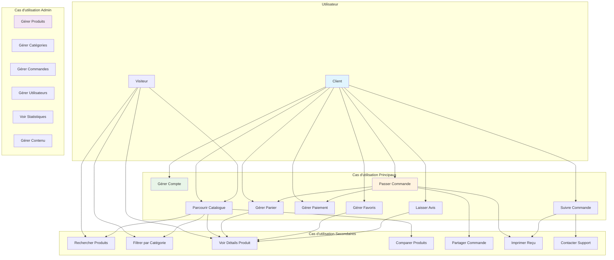
```mermaid
graph TD
    subgraph "Utilisateur"
        A[Client]
        B[Visiteur]
    end
    
    subgraph "Cas d'utilisation Principaux"
        C[Gérer Compte]
        D[Parcourir Catalogue]
        E[Gérer Panier]
        F[Passer Commande]
        G[Gérer Paiement]
        H[Gérer Favoris]
        I[Laisser Avis]
        J[Suivre Commande]
    end
    
    subgraph "Cas d'utilisation Secondaires"
        K[Rechercher Produits]
        L[Filtrer par Catégorie]
        M[Voir Détails Produit]
        N[Comparer Produits]
        O[Partager Commande]
        P[Imprimer Reçu]
        Q[Contacter Support]
    end
    
    subgraph "Cas d'utilisation Admin"
        R[Gérer Produits]
        S[Gérer Catégories]
        T[Gérer Commandes]
        U[Gérer Utilisateurs]
        V[Voir Statistiques]
        W[Gérer Contenu]
    end
    
    A --> C
    A --> D
    A --> E
    A --> F
    A --> G
    A --> H
    A --> I
    A --> J
    
    B --> D
    B --> K
    B --> L
    B --> M
    
    D --> K
    D --> L
    D --> M
    D --> N
    
    E --> M
    F --> E
    F --> G
    F --> P
    F --> O
    
    H --> M
    
    I --> M
    
    J --> P
    J --> Q
    
    style A fill:#e1f5fe
    style R fill:#f3e5f5
    style C fill:#e8f5e8
    style F fill:#fff3e0
```

### Diagramme de Séquence - Processus d'Achat

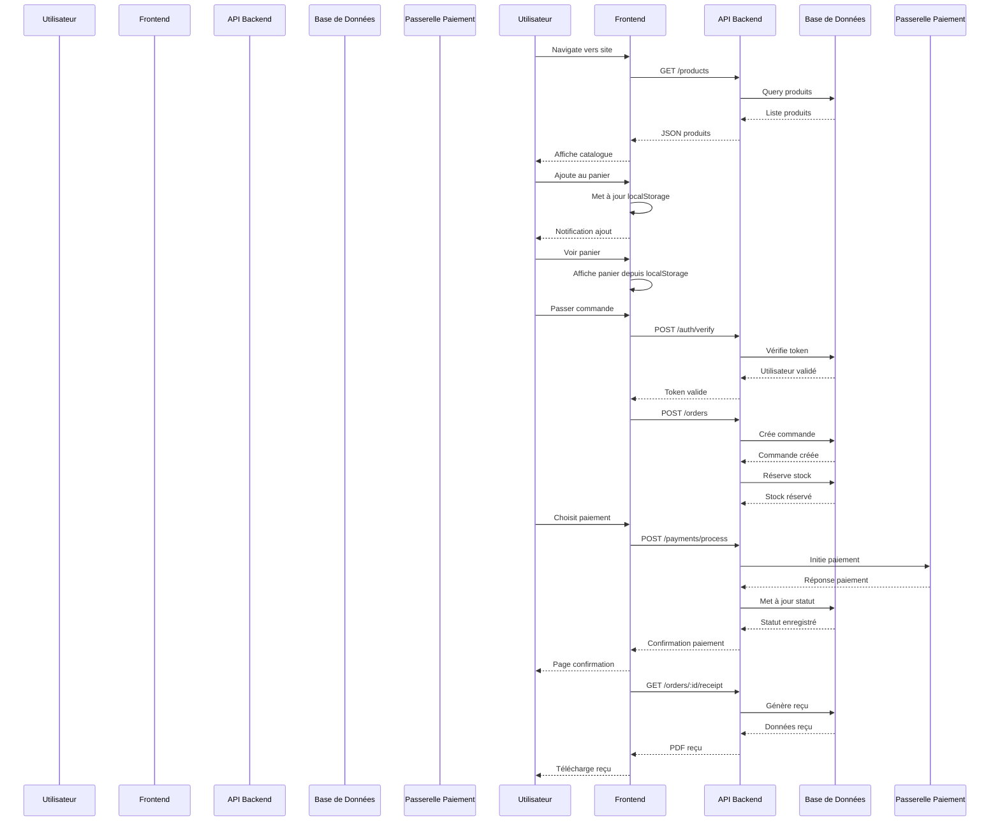
```mermaid
sequenceDiagram
    participant U as Utilisateur
    participant FE as Frontend
    participant API as API Backend
    participant DB as Base de Données
    participant PG as Passerelle Paiement
    
    Utilisateur->>Frontend: Navigate vers site
    Frontend->>API Backend: GET /products
    API Backend->>Base de Données: Query produits
    Base de Données-->>API Backend: Liste produits
    API Backend-->>Frontend: JSON produits
    Frontend-->>Utilisateur: Affiche catalogue
    
    Utilisateur->>Frontend: Ajoute au panier
    Frontend->>Frontend: Met à jour localStorage
    Frontend-->>Utilisateur: Notification ajout
    
    Utilisateur->>Frontend: Voir panier
    Frontend->>Frontend: Affiche panier depuis localStorage
    
    Utilisateur->>Frontend: Passer commande
    Frontend->>API Backend: POST /auth/verify
    API Backend->>Base de Données: Vérifie token
    Base de Données-->>API Backend: Utilisateur validé
    API Backend-->>Frontend: Token valide
    
    Frontend->>API Backend: POST /orders
    API Backend->>Base de Données: Crée commande
    Base de Données-->>API Backend: Commande créée
    API Backend->>Base de Données: Réserve stock
    Base de Données-->>API Backend: Stock réservé
    
    Utilisateur->>Frontend: Choisit paiement
    Frontend->>API Backend: POST /payments/process
    API Backend->>Passerelle Paiement: Initie paiement
    Passerelle Paiement-->>API Backend: Réponse paiement
    API Backend->>Base de Données: Met à jour statut
    Base de Données-->>API Backend: Statut enregistré
    API Backend-->>Frontend: Confirmation paiement
    Frontend-->>Utilisateur: Page confirmation
    
    Frontend->>API Backend: GET /orders/:id/receipt
    API Backend->>Base de Données: Génère reçu
    Base de Données-->>API Backend: Données reçu
    API Backend-->>Frontend: PDF reçu
    Frontend-->>Utilisateur: Télécharge reçu
```

### Diagramme de Séquence - Processus d'Authentification

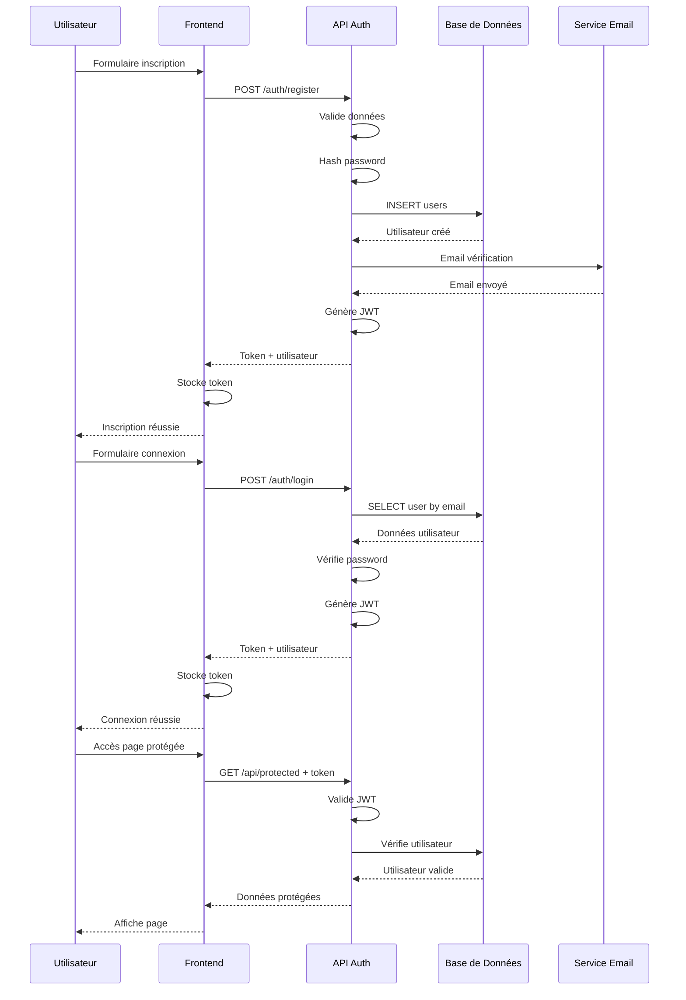
```mermaid
sequenceDiagram
    participant U as Utilisateur
    participant F as Frontend
    participant A as API Auth
    participant DB as Base de Données
    participant E as Service Email
    
    U->>F: Formulaire inscription
    F->>A: POST /auth/register
    A->>A: Valide données
    A->>A: Hash password
    A->>DB: INSERT users
    DB-->>A: Utilisateur créé
    A->>E: Email vérification
    E-->>A: Email envoyé
    A->>A: Génère JWT
    A-->>F: Token + utilisateur
    F->>F: Stocke token
    F-->>U: Inscription réussie
    
    U->>F: Formulaire connexion
    F->>A: POST /auth/login
    A->>DB: SELECT user by email
    DB-->>A: Données utilisateur
    A->>A: Vérifie password
    A->>A: Génère JWT
    A-->>F: Token + utilisateur
    F->>F: Stocke token
    F-->>U: Connexion réussie
    
    U->>F: Accès page protégée
    F->>A: GET /api/protected + token
    A->>A: Valide JWT
    A->>DB: Vérifie utilisateur
    DB-->>A: Utilisateur valide
    A-->>F: Données protégées
    F-->>U: Affiche page
```

### Diagramme de Séquence - Gestion Panier

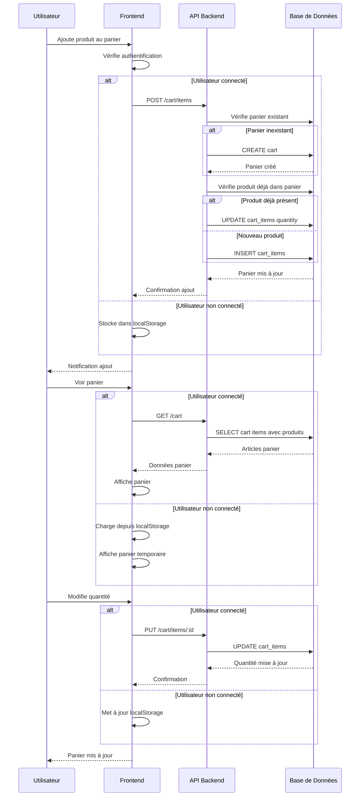
```mermaid
sequenceDiagram
    participant U as Utilisateur
    participant F as Frontend
    participant API as API Backend
    participant DB as Base de Données
    
    U->>F: Ajoute produit au panier
    F->>F: Vérifie authentification
    alt Utilisateur connecté
        F->>API: POST /cart/items
        API->>DB: Vérifie panier existant
        alt Panier inexistant
            API->>DB: CREATE cart
            DB-->>API: Panier créé
        end
        API->>DB: Vérifie produit déjà dans panier
        alt Produit déjà présent
            API->>DB: UPDATE cart_items quantity
        else Nouveau produit
            API->>DB: INSERT cart_items
        end
        DB-->>API: Panier mis à jour
        API-->>F: Confirmation ajout
    else Utilisateur non connecté
        F->>F: Stocke dans localStorage
    end
    F-->>U: Notification ajout
    
    U->>F: Voir panier
    alt Utilisateur connecté
        F->>API: GET /cart
        API->>DB: SELECT cart items avec produits
        DB-->>API: Articles panier
        API-->>F: Données panier
        F->>F: Affiche panier
    else Utilisateur non connecté
        F->>F: Charge depuis localStorage
        F->>F: Affiche panier temporaire
    end
    
    U->>F: Modifie quantité
    alt Utilisateur connecté
        F->>API: PUT /cart/items/:id
        API->>DB: UPDATE cart_items
        DB-->>API: Quantité mise à jour
        API-->>F: Confirmation
    else Utilisateur non connecté
        F->>F: Met à jour localStorage
    end
    F-->>U: Panier mis à jour
```

### Diagramme de Séquence - Gestion Favoris

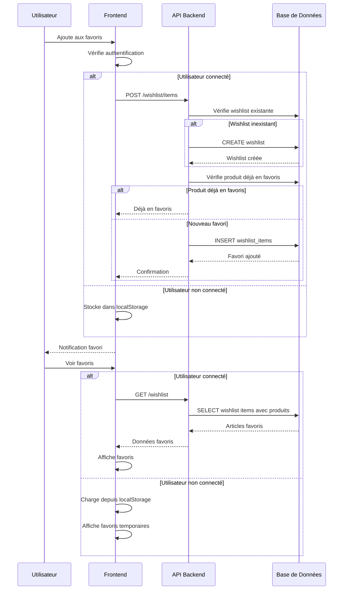
```mermaid
sequenceDiagram
    participant U as Utilisateur
    participant F as Frontend
    participant API as API Backend
    participant DB as Base de Données
    
    U->>F: Ajoute aux favoris
    F->>F: Vérifie authentification
    alt Utilisateur connecté
        F->>API: POST /wishlist/items
        API->>DB: Vérifie wishlist existante
        alt Wishlist inexistant
            API->>DB: CREATE wishlist
            DB-->>API: Wishlist créée
        end
        API->>DB: Vérifie produit déjà en favoris
        alt Produit déjà en favoris
            API-->>F: Déjà en favoris
        else Nouveau favori
            API->>DB: INSERT wishlist_items
            DB-->>API: Favori ajouté
            API-->>F: Confirmation
        end
    else Utilisateur non connecté
        F->>F: Stocke dans localStorage
    end
    F-->>U: Notification favori
    
    U->>F: Voir favoris
    alt Utilisateur connecté
        F->>API: GET /wishlist
        API->>DB: SELECT wishlist items avec produits
        DB-->>API: Articles favoris
        API-->>F: Données favoris
        F->>F: Affiche favoris
    else Utilisateur non connecté
        F->>F: Charge depuis localStorage
        F->>F: Affiche favoris temporaires
    end
```

### Diagramme de Séquence - Système d'Avis

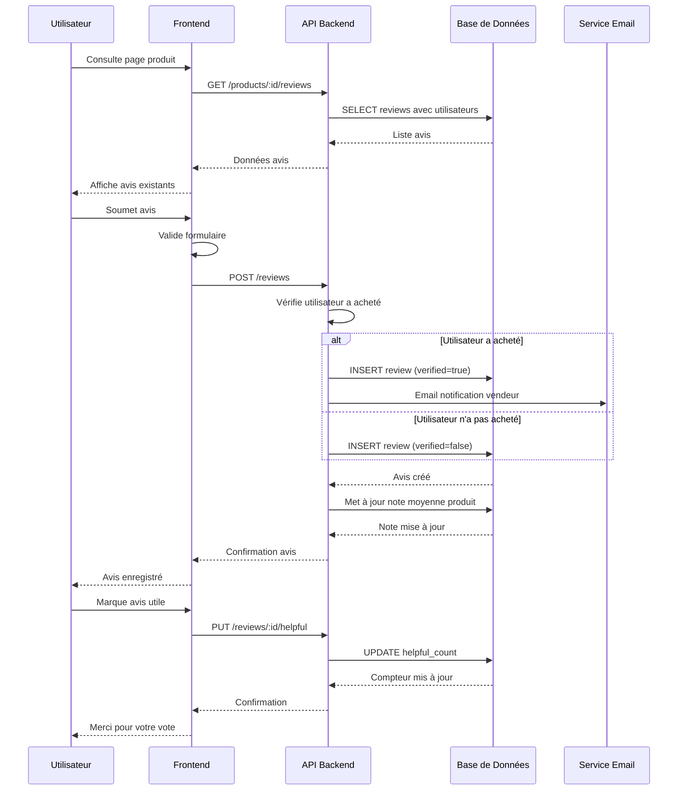
```mermaid
sequenceDiagram
    participant U as Utilisateur
    participant F as Frontend
    participant API as API Backend
    participant DB as Base de Données
    participant E as Service Email
    
    U->>F: Consulte page produit
    F->>API: GET /products/:id/reviews
    API->>DB: SELECT reviews avec utilisateurs
    DB-->>API: Liste avis
    API-->>F: Données avis
    F-->>U: Affiche avis existants
    
    U->>F: Soumet avis
    F->>F: Valide formulaire
    F->>API: POST /reviews
    API->>API: Vérifie utilisateur a acheté
    alt Utilisateur a acheté
        API->>DB: INSERT review (verified=true)
        API->>E: Email notification vendeur
    else Utilisateur n'a pas acheté
        API->>DB: INSERT review (verified=false)
    end
    DB-->>API: Avis créé
    API->>DB: Met à jour note moyenne produit
    DB-->>API: Note mise à jour
    API-->>F: Confirmation avis
    F-->>U: Avis enregistré
    
    U->>F: Marque avis utile
    F->>API: PUT /reviews/:id/helpful
    API->>DB: UPDATE helpful_count
    DB-->>API: Compteur mis à jour
    API-->>F: Confirmation
    F-->>U: Merci pour votre vote
```

---

## Flux de Données

### Cycle de Vie d'une Commande

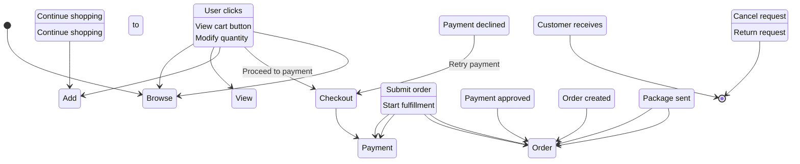
```mermaid
stateDiagram-v2
    [*] --> Browse Products
    
    Browse Products --> Add to Cart: User clicks
    Add to Cart --> Browse Products: Continue shopping
    Add to Cart --> View Cart: View cart button
    
    View Cart --> Add to Cart: Modify quantity
    View Cart --> Checkout: Proceed to payment
    View Cart --> Browse Products: Continue shopping
    
    Checkout --> Payment Processing: Submit order
    Payment Processing --> Payment Success: Payment approved
    Payment Processing --> Payment Failed: Payment declined
    Payment Failed --> Checkout: Retry payment
    
    Payment Success --> Order Confirmed: Order created
    Order Confirmed --> Order Processing: Start fulfillment
    Order Processing --> Order Shipped: Package sent
    Order Shipped --> Order Delivered: Customer receives
    Order Delivered --> [*]
    
    Order Processing --> Order Cancelled: Cancel request
    Order Shipped --> Order Cancelled: Return request
    Order Cancelled --> [*]
```

### Gestion du Stock

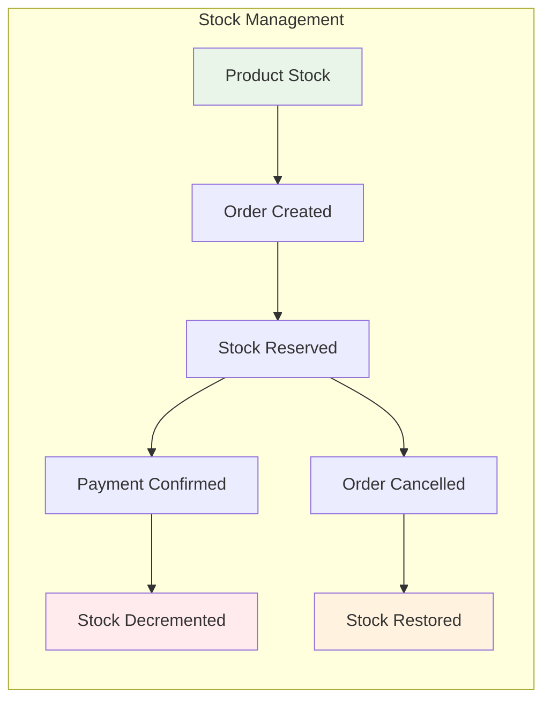
```mermaid
flowchart LR
    subgraph "Stock Management"
        A[Product Stock]
        B[Order Created]
        C[Stock Reserved]
        D[Payment Confirmed]
        E[Stock Decremented]
        F[Order Cancelled]
        G[Stock Restored]
    end
    
    A --> B
    B --> C
    C --> D
    D --> E
    C --> F
    F --> G
    
    style A fill:#e8f5e8
    style E fill:#ffebee
    style G fill:#fff3e0
```

---

## Sécurité

### Architecture de Sécurité

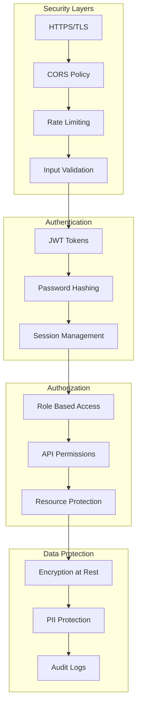
```mermaid
flowchart TD
    subgraph "Security Layers"
        A[HTTPS/TLS]
        B[CORS Policy]
        C[Rate Limiting]
        D[Input Validation]
    end
    
    subgraph "Authentication"
        E[JWT Tokens]
        F[Password Hashing]
        G[Session Management]
    end
    
    subgraph "Authorization"
        H[Role Based Access]
        I[API Permissions]
        J[Resource Protection]
    end
    
    subgraph "Data Protection"
        K[Encryption at Rest]
        L[PII Protection]
        M[Audit Logs]
    end
    
    A --> B
    B --> C
    C --> D
    D --> E
    
    E --> F
    F --> G
    G --> H
    
    H --> I
    I --> J
    J --> K
    
    K --> L
    L --> M
```

### Flux d'Authentification

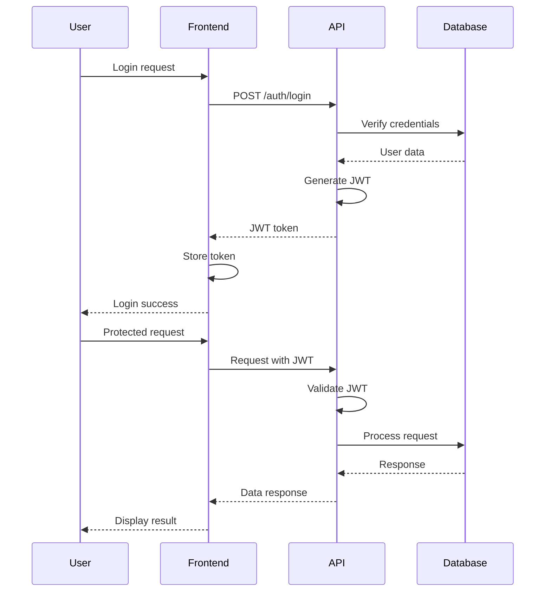
```mermaid
sequenceDiagram
    participant U as User
    participant F as Frontend
    participant A as API
    participant D as Database
    
    U->>F: Login request
    F->>A: POST /auth/login
    A->>D: Verify credentials
    D-->>A: User data
    A->>A: Generate JWT
    A-->>F: JWT token
    F->>F: Store token
    F-->>U: Login success
    
    U->>F: Protected request
    F->>A: Request with JWT
    A->>A: Validate JWT
    A->>D: Process request
    D-->>A: Response
    A-->>F: Data response
    F-->>U: Display result
```

---

## Métriques et Monitoring

### Indicateurs Clés

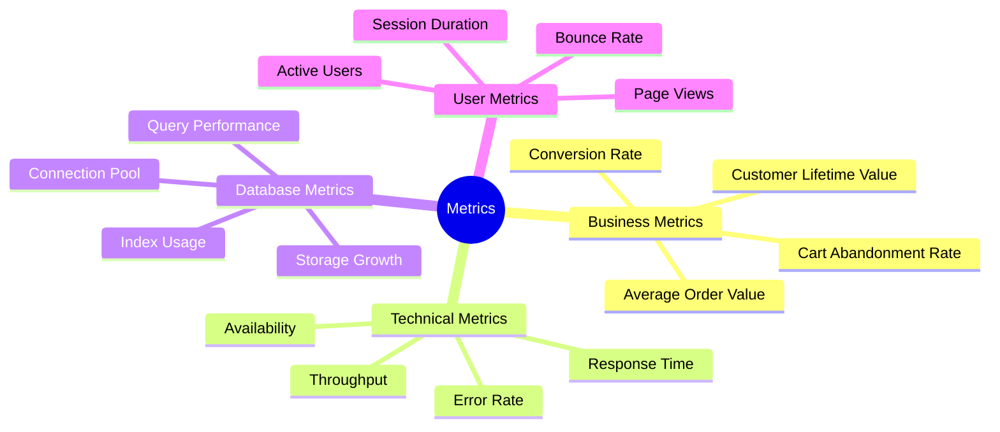
```mermaid
mindmap
  root((Metrics))
    Business Metrics
      Conversion Rate
      Average Order Value
      Customer Lifetime Value
      Cart Abandonment Rate
    Technical Metrics
      Response Time
      Error Rate
      Throughput
      Availability
    Database Metrics
      Query Performance
      Connection Pool
      Index Usage
      Storage Growth
    User Metrics
      Active Users
      Session Duration
      Page Views
      Bounce Rate
```

---

## Instructions Exportation PDF

### Méthodes Recommandées

#### 1. **Via Typora (Recommandé)**
- Ouvrir `project-diagrams.md` dans Typora
- Activer le rendu des diagrammes Mermaid
- Fichier → Export → PDF
- Paramètres : A4, Marges normales, Qualité haute

#### 2. **Via VS Code + Extensions**
- Installer extensions : "Markdown PDF", "Mermaid Preview"
- Ouvrir le fichier, prévisualiser les diagrammes
- Ctrl+Shift+P → "Markdown PDF: Export"

#### 3. **Via Pandoc**
```bash
# Installer Pandoc + Mermaid filter
pandoc --install mermaid-filter

# Exporter en PDF
pandoc project-diagrams.md --pdf-engine=xelatex --filter=mermaid-filter -o project-diagrams.pdf
```

#### 4. **Via Navigateur Web**
- Ouvrir dans GitHub/GitLab (rendu automatique Mermaid)
- Imprimer → "Enregistrer comme PDF"

#### 5. **Via Mermaid Live Editor**
- Copier chaque diagramme individuellement
- Coller dans https://mermaid.live
- Exporter en SVG/PNG puis assembler en PDF

### Optimisations pour l'Impression

- **Format A4** standard pour impression professionnelle
- **Orientation Portrait** pour lisibilité maximale
- **Qualité 300 DPI** pour rendu net
- **Mises en page séparées** par type de diagramme
- **Table des matières cliquables** pour navigation

### Résultat Attendu

Le PDF final contiendra :
- Page de titre avec informations projet
- Table des matières interactive
- Tous les diagrammes UML **avec couleurs conservées**
- Architecture système et base de données
- Documentation technique complète
- Format professionnel prêt pour présentation

### Conservation des Couleurs

**OUI, les couleurs seront conservées !** Les diagrammes Mermaid utilisent des styles qui s'exportent parfaitement en PDF :

#### Méthodes avec Conservation des Couleurs :
1. **Typora** - Garde 100% des couleurs
2. **VS Code + Markdown PDF** - Couleurs intactes
3. **GitHub/GitLab + Impression** - Couleurs préservées
4. **Mermaid Live + Export** - Couleurs exactes

#### Couleurs dans les Diagrammes :
- **Bleu clair** (`#e1f5fe`) - Utilisateurs
- **Violet** (`#f3e5f5`) - Base de données  
- **Orange** (`#fff3e0`) - Paiements
- **Vert** (`#e8f5e8`) - Actions validées
- **Rouge** (`#ffebee`) - Actions critiques

#### Conseils pour l'Export :
- Choisir "Impression couleur" dans les options
- Éviter le mode "Niveaux de gris"
- Qualité "Haute" pour préserver les nuances
- Aucune conversion en noir/blanc

---

## Conclusion

Ce document présente l'architecture complète du projet SNEAKERS avec tous les schémas techniques nécessaires pour comprendre et maintenir l'application.

### Points Clés
- **Architecture Scalable** : Conçue pour croître avec le business
- **Sécurité Robuste** : Plusieurs couches de protection
- **Performance Optimisée** : Base de données et API optimisées
- **Maintenance Facile** : Code bien structuré et documenté

### Technologies Utilisées
- **Frontend** : HTML5, CSS3, JavaScript Vanilla
- **Backend** : Node.js, Express.js, JWT
- **Database** : MySQL 8.0, Redis
- **Infrastructure** : Docker, Nginx

---

**Document généré le :** 15 Décembre 2025  
**Version :** 1.0  
**Auteur :** Équipe SNEAKERS

> *Ce document peut être converti en PDF via des outils comme Pandoc, Markdown PDF, ou des éditeurs comme Typora.*
